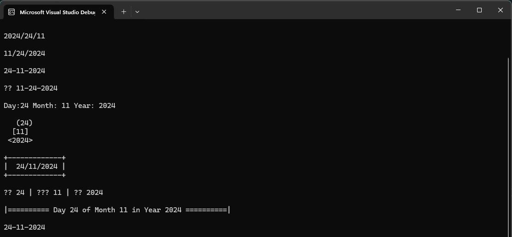

Format Date is a powerful C++ program for parsing, validating, and formatting dates. With multiple formatting options, it allows users to display dates in creative and customizable ways.


---

## 🚀 Features
- Parse dates from a string (e.g., `dd/mm/yyyy`).
- Validate date formats to ensure correctness.
- Convert dates to various styles, including:
  - Traditional formats: `dd/mm/yyyy`, `mm-dd-yyyy`.
  - Creative styles: Circle, ASCII box, Emojis, Timeline.
- Replace and customize date strings easily.

---

## 📂 How to Use
1. Clone the repository:
   ```bash
   git clone https://github.com/your-username/DateMaster.git
   cd DateMaster
---

## 🖥️ Output Preview
Here is a preview of the program's output after running it:


